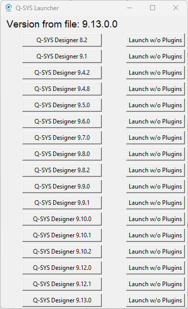
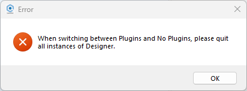
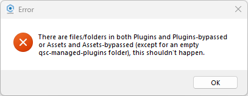

# Q-SYS Designer Launcher with Plugin Suppression  

This is a fork of version 1.1 of [this awesome Launcher](https://github.com/UW-WMW/QSYS-Launcher) by [Uwe Weissbach](https://github.com/UW-WMW), with added functionality to start Q-SYS Designer either with or without plugins for quicker loading times.

---

## :exclamation: Important  

**Please back up your entire `Documents\QSC` folder, which contains the `Plugins` and `Assets` folders.**  
This tool moves files between those folders and newly created `Plugins-bypassed` and `Assets-bypassed` folders. While considerable effort has been made to minimize the possibility of file loss, please back up your plugins and use this tool at your own risk.

---

## Instructions  

1. [Download the latest release from GitHub](https://github.com/BoomboxAV/QSYS-Launcher/releases).  

2. Extract the entire release zip to a safe location where it will remain.  
   > **Note:** This differs slightly from the upstream repo's releases, as this version is not compiled in "onefile" mode. This improves launch times and prevents certain issues with PyInstaller's onefile mode.  

3. Right-click on a `.qsys` file and select **Open with**.  

4. Navigate to the location of `Q-SYS Launcher with Plugin Suppression.exe` and select it.  
   - Check the box for **Always use this app to open .qsys files** so the launcher will handle them by default.  

5. To open a `.qsys` file, simply double-click it. The launcher will prompt you to select which version of Q-SYS Designer to use from your installed versions.  

---

### :exclamation: Important  
If you install a new version of Q-SYS Designer, you may need to repeat the **Open with** process, as the installer will re-associate `.qsys` files with the latest version of Designer.  

---

## Compiling Your Own Version  

If you decide to compile your own version, I used **auto-py-to-exe** for this. Note that you may need to adjust the path to the icon file, as auto-py-to-exe does not handle relative paths well.

---

## How Plugin Suppression Works  

Q-SYS Designer scans `Documents\QSC\Assets` and `Documents\QSC\Plugins` while launching. Depending on your system performance, and the number and size of plugins, this process can take a significant amount of time.  

Often, when users launch Q-SYS Designer just to pull from a Core or modify an existing file, dragging in new instances of plugins is unnecessary. This launcher provides an efficient solution by significantly reducing launch times when new plugin instances are not needed.  

### Features:  
- The **left column** behaves like the original launcher, launching the selected Q-SYS Designer version normally, with plugins.  
- The **right column** launches the selected version of Q-SYS Designer after moving plugins to the `Plugins-bypassed` and `Assets-bypassed` folders, leaving the `Plugins` and `Assets` folders empty for quicker launches.  
- The launcher moves plugins between `Plugins` and `Plugins-bypassed` and between `Assets` and `Assets-bypassed` only when **changing modes**.  

### Notes:  
- There is a small delay when changing modes due to process scanning and file moving, mostly the former.  
- The largest time savings occur when repeatedly launching Q-SYS Designer without plugins.  

---

## Errors

If Q-SYS Designer is running when changing plugin modes, the launcher will detect it and display a message box. It will not move files / change modes unless all instances of Q-SYS Designer are closed.

If you see this, manually sort out the situation in Documents\QSC.  If this happens through normal usage of this launcher, please make an issue / let Andy know!

---

## Thanks To:  

- [Uwe Weissbach](https://github.com/UW-WMW), who developed the launcher this came from.  
- Zach Lisko ([mckay115](https://github.com/mckay115)), who developed an earlier launcher.  
